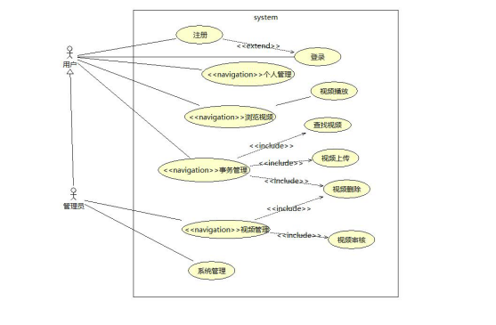

视频浏览： 用户可以浏览视频网页的界面

登录与注册：用户填写并提交用户名和密码，系统进行身份验证，显示相应身份 对应的页面。如果没有注册，可以先进行注册。

事务管理：用户可以上传视频、删除视频、查找视频

​	视频上传：用户可以上传视频，视频通过管理员审核之后，可以在视频页面显示

​	删除视频：用户可以删除其上传的视频

​	查找视频：用户可以根据关键字在视频网页界面查找视频

 视频播放：用户可以播放视频

 视频管理：管理员对视频进行管理，包括视频审核，视频删除

视频审核：管理员对用户上传的视频进行审核

​	视频删除：管理员可以删除不符合规定的视频

系统管理：管理员管理视频网站系统

